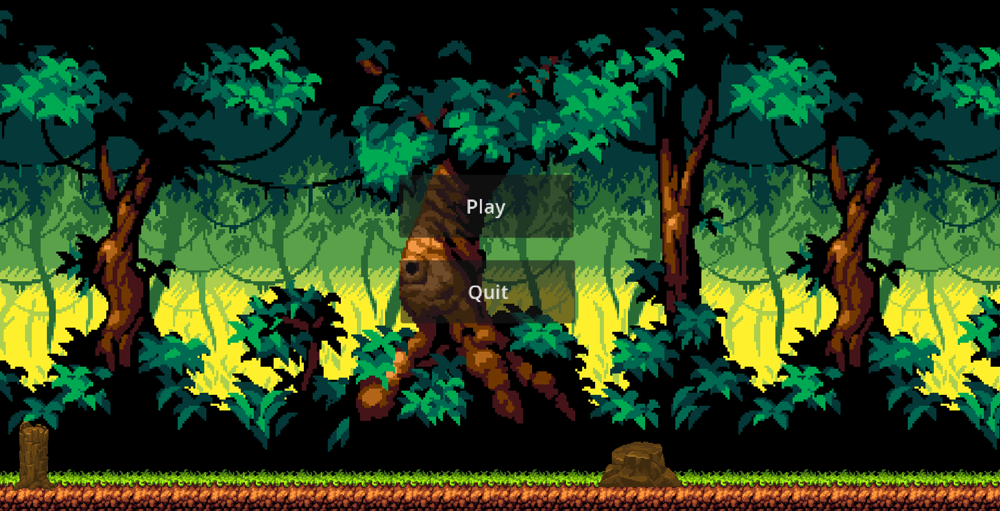
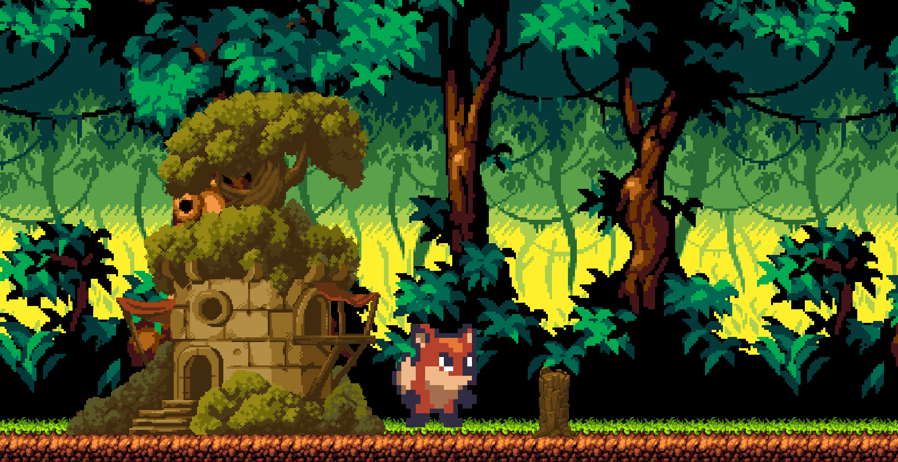
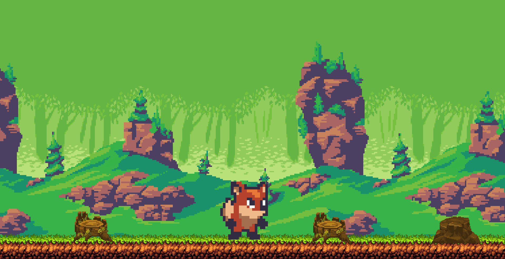
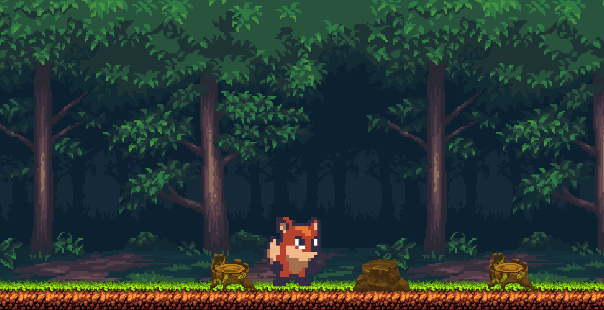

# SunnyLand 🌳🦊

Welcome to **SunnyLand**, a simple and fun platformer game developed using Godot 4.2.2. In this game, you play as a brave fox who must journey through three dense forests to reach the end of the level. Each forest presents its own challenges and obstacles, but with quick reflexes and a little bit of courage, you'll guide the fox safely through to victory!

## Story 🦊

In SunnyLand, you take on the role of a fox who is on a mission to explore the enchanting forests of SunnyLand. As you navigate through the lush green trees, you must avoid various obstacles and enemies that stand in your way. Your goal is to reach the end of each forest and finally make it to the end of the level. Will you be able to guide the fox safely through all three forests and complete the journey?

## How to Run the Game 🚀

To run SunnyLand on your local machine:

1. **Download the GitHub repository**:
   - Clone the repository using `git clone https://github.com/yourusername/SunnyLand.git`.
   - Or download the ZIP file from the GitHub repository and extract it.

2. **Open the Project in Godot**:
   - Make sure you have **Godot 4.2.2 Stable Edition** installed on your machine.
   - Open Godot, then click on the "Import" button.
   - Navigate to the location where you cloned or extracted the SunnyLand project and select the `project.godot` file.

3. **Run the Game**:
   - With the project open in Godot, simply press the "Play" button or hit `F5` to run the game.

## Screenshots 📸

Here are some screenshots of SunnyLand in action:

## Gameplay Video 🎥

Check out this video to see the gameplay of SunnyLand:

---

Enjoy your adventure through SunnyLand, and thank you for playing! If you have any feedback or encounter any issues, feel free to open an issue on GitHub or reach out directly.

